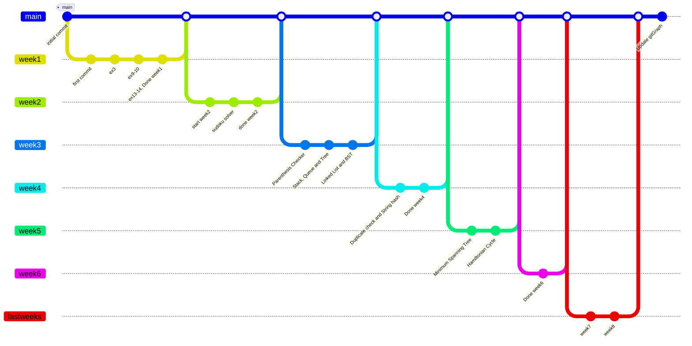
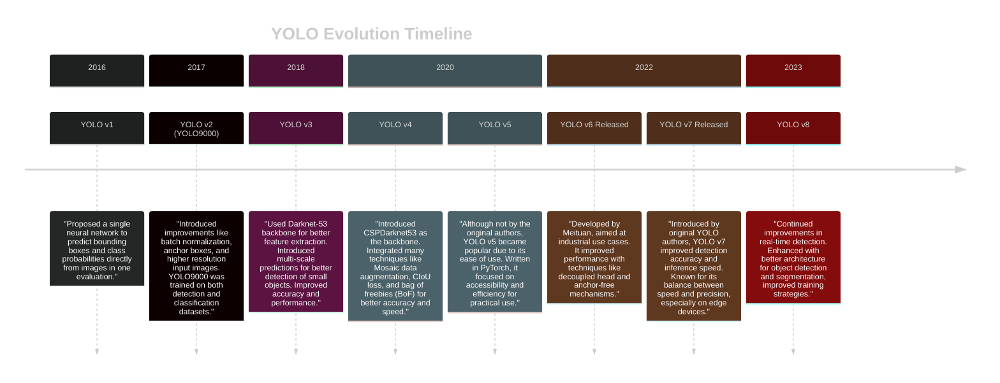

# GithubTrials

```mermaid
gitGraph
   commit id:"initial commit" tag:"main"

   branch week1
   checkout week1
   commit id:"first commit"
   commit id:"ex3"
   commit id:"ex9-10"
   commit id:"ex13-14, Done week1"
   checkout main
   merge week1

   branch week2
   checkout week2
   commit id:"start week2"
   commit id:"sudoku solver"
   commit id:"done week2"
   checkout main
   merge week2

   branch week3
   checkout week3
   commit id:"Parenthesis Checker"
   commit id:"Stack, Queue and Tree"
   commit id:"Linked List and BST"
   checkout main
   merge week3

   branch week4
   checkout week4
   commit id:"Duplicate check and String hash"
   commit id:"Done week4"
   checkout main
   merge week4

   branch week5
   checkout week5
   commit id:"Minimum Spanning Tree"
   commit id:"Hamiltonian Cycle"
   checkout main
   merge week5

   branch week6
   checkout week6
   commit id:"Done week6"
   checkout main
   merge week6

   branch lastweeks
   checkout lastweeks
   commit id:"week7"
   commit id:"week8"
   checkout main
   merge lastweeks

   commit id:"Update gitGraph"

```

```mermaid
%%{init: { 'logLevel': 'debug', 'theme': 'dark' } }%%
timeline
    title YOLO Evolution Timeline

    section 2016
        YOLO v1 : "Proposed a single neural network to predict bounding boxes and class probabilities directly from images in one evaluation."

    section 2017
        YOLO v2 (YOLO9000) : "Introduced improvements like batch normalization, anchor boxes, and higher resolution input images. YOLO9000 was trained on both detection and classification datasets."

    section 2018
        YOLO v3 : "Used Darknet-53 backbone for better feature extraction. Introduced multi-scale predictions for better detection of small objects. Improved accuracy and performance."

    section 2020
        YOLO v4: "Introduced CSPDarknet53 as the backbone. Integrated many techniques like Mosaic data augmentation, CIoU loss, and bag of freebies (BoF) for better accuracy and speed."

        YOLO v5: "Although not by the original authors, YOLO v5 became popular due to its ease of use. Written in PyTorch, it focused on accessibility and efficiency for practical use."

    section 2022
        YOLO v6 Released : "Developed by Meituan, aimed at industrial use cases. It improved performance with techniques like decoupled head and anchor-free mechanisms."

        YOLO v7 Released : "Introduced by original YOLO authors, YOLO v7 improved detection accuracy and inference speed. Known for its balance between speed and precision, especially on edge devices."

    section 2023
        YOLO v8 : "Continued improvements in real-time detection. Enhanced with better architecture for object detection and segmentation, improved training strategies."
```
