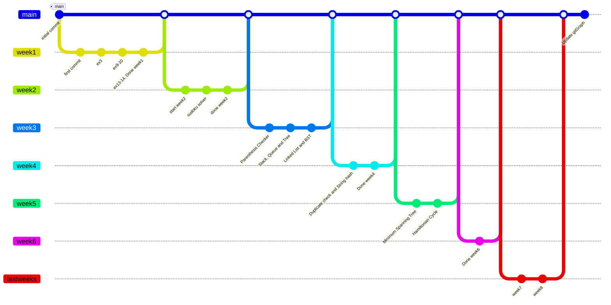

# GithubTrials

```mermaid
gitGraph
   commit id:"initial commit" tag:"main"

   branch week1
   checkout week1
   commit id:"first commit"
   commit id:"ex3"
   commit id:"ex9-10"
   commit id:"ex13-14, Done week1"
   checkout main
   merge week1

   branch week2
   checkout week2
   commit id:"start week2"
   commit id:"sudoku solver"
   commit id:"done week2"
   checkout main
   merge week2

   branch week3
   checkout week3
   commit id:"Parenthesis Checker"
   commit id:"Stack, Queue and Tree"
   commit id:"Linked List and BST"
   checkout main
   merge week3

   branch week4
   checkout week4
   commit id:"Duplicate check and String hash"
   commit id:"Done week4"
   checkout main
   merge week4

   branch week5
   checkout week5
   commit id:"Minimum Spanning Tree"
   commit id:"Hamiltonian Cycle"
   checkout main
   merge week5

   branch week6
   checkout week6
   commit id:"Done week6"
   checkout main
   merge week6

   branch lastweeks
   checkout lastweeks
   commit id:"week7"
   commit id:"week8"
   checkout main
   merge lastweeks

   commit id:"Update gitGraph"

```
