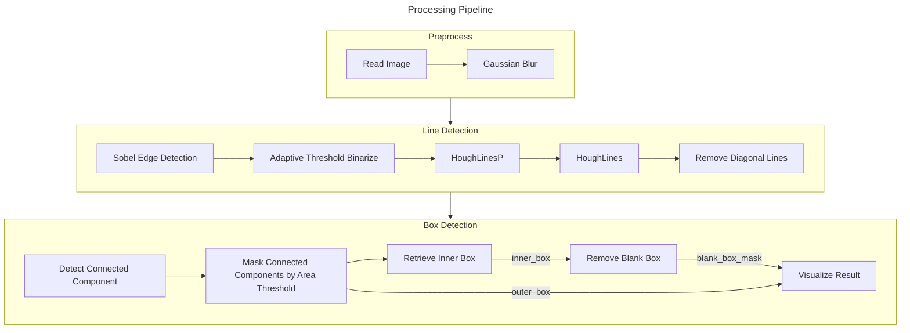
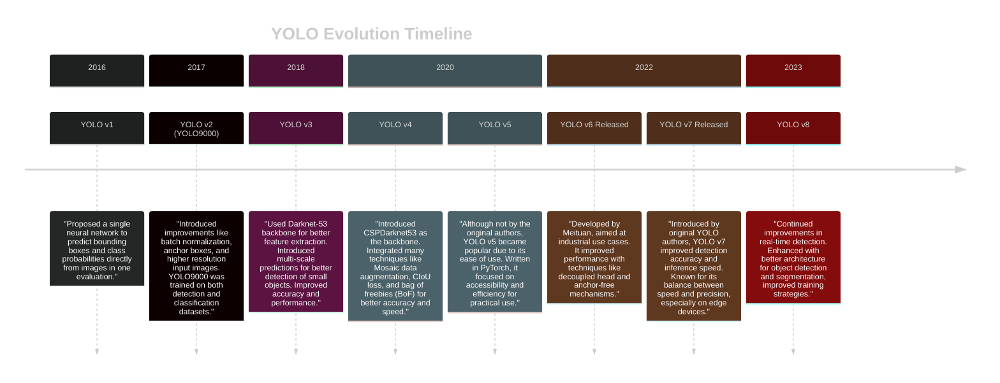

```mermaid
---
title: Processing Pipeline
---
flowchart TB

    1[Read Image]
    2[Gaussian Blur]

    3[Sobel Edge Detection]
    4[Adaptive Threshold Binarize]
    5[HoughLinesP]
    6[HoughLines]
    7[Remove Diagonal Lines]

    8[Detect Connected Component]
    9[Mask Connected Components by Area Threshold]
    10[Retrieve Inner Box]
    11[Remove Blank Box]
    12[Visualize Result]

    subgraph A [Preprocess]
        direction LR
        1 --> 2
    end
    
    subgraph B [Line Detection]
        direction LR
        3 --> 4 --> 5 --> 6 --> 7
    end

    subgraph C [Box Detection]
        direction LR
        8 --> 9 --> 10 -->|inner_box| 11 -->|blank_box_mask| 12
        9 -->|outer_box| 12
    end

    A --> B
    B --> C

```

```mermaid
%%{init: { 'logLevel': 'debug', 'theme': 'dark' } }%%
timeline
    title YOLO Evolution Timeline

    section 2016
        YOLO v1 : "Proposed a single neural network to predict bounding boxes and class probabilities directly from images in one evaluation."

    section 2017
        YOLO v2 (YOLO9000) : "Introduced improvements like batch normalization, anchor boxes, and higher resolution input images. YOLO9000 was trained on both detection and classification datasets."

    section 2018
        YOLO v3 : "Used Darknet-53 backbone for better feature extraction. Introduced multi-scale predictions for better detection of small objects. Improved accuracy and performance."

    section 2020
        YOLO v4: "Introduced CSPDarknet53 as the backbone. Integrated many techniques like Mosaic data augmentation, CIoU loss, and bag of freebies (BoF) for better accuracy and speed."

        YOLO v5: "Although not by the original authors, YOLO v5 became popular due to its ease of use. Written in PyTorch, it focused on accessibility and efficiency for practical use."

    section 2022
        YOLO v6 Released : "Developed by Meituan, aimed at industrial use cases. It improved performance with techniques like decoupled head and anchor-free mechanisms."

        YOLO v7 Released : "Introduced by original YOLO authors, YOLO v7 improved detection accuracy and inference speed. Known for its balance between speed and precision, especially on edge devices."

    section 2023
        YOLO v8 : "Continued improvements in real-time detection. Enhanced with better architecture for object detection and segmentation, improved training strategies."
```
